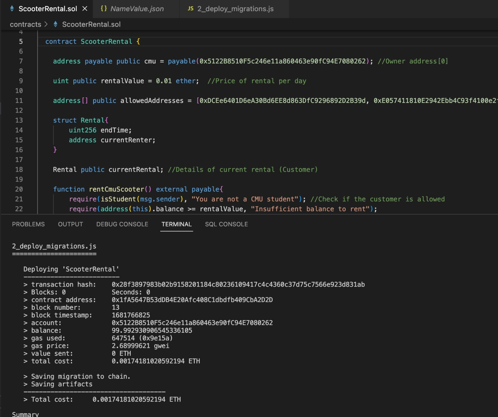
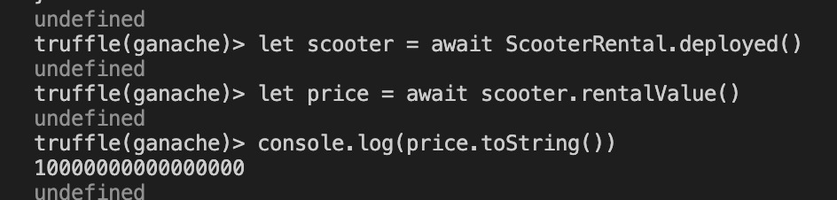
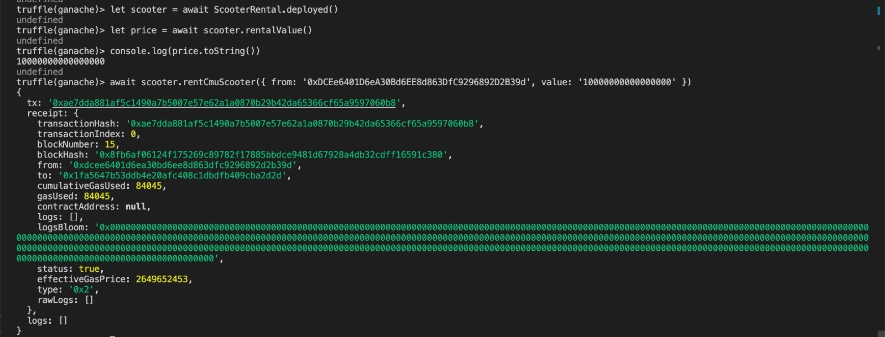

# ScooterRental Smart Contract

The `ScooterRental` smart contract is an Ethereum-based contract that allows a group of pre-approved users (CMU students in this case) to rent a scooter for a fixed period of time at a fixed price. 

The contract is written in Solidity and uses the version 0.8.0`.

## Features

1. The scooter rental price is fixed at 0.01 ether per day.
2. The rental period is fixed at one day from the block creation time.
3. The contract owner (cmu) receives the rental payment directly upon renting the scooter.

## Functions

### rentCmuScooter()

This function allows a user to rent the scooter if they meet the necessary conditions. The function takes no arguments and has the following requirements:

- The sender must be a pre-approved CMU student.
- The contract must have sufficient balance to cover the rental cost.
- The rental value sent must be equal to the fixed rental price (0.01 ether).

Upon successful execution, the function sets the `endTime` for the rental to be 1 day from the current block timestamp and assigns the `currentRenter` to the sender's address. The rental payment is transferred to the contract owner (cmu).

### isStudent(address _address)

This view function takes an Ethereum address as an argument and checks if the address belongs to a pre-approved CMU student. It returns `true` if the address is found in the `allowedAddresses` array and `false` otherwise.

## Usage

To deploy this smart contract, 

1. Run ganache quick start and leave it running for the remainder of this part.

2. To create a package.json file, run the following command from within the project directory:

   ~~~javascript
   npm init
   ~~~

3. Take the suggested defaults.

4. From the project directory, run the command

   ~~~
   npm install dotenv truffle-wallet-provider ethereumjs-wallet
   ~~~

   This creates a node_modules directory. Ignore the warnings.

5. To compile and deploy the two contracts (Migrations.sol and Faucet.sol) to the blockchain (represented by Ganache), make sure that Ganache is running and execute the command:

   ~~~
   truffle migrate --reset

To interact with the deployed contract and accounts, use the truffle console.

1. From the command line, execute the following commands:

   ~~~
   truffle console

2. Execute the following command within the truffle console.

   ~~~javascript
   let scooter = await ScooterRental.deployed()
   let price = await scooter.rentalValue()
   console.log(price.toString())
   await scooter.rentCmuScooter({ from: '0xDCEe6401D6eA30Bd6EE8d863DfC9296892D2B39d', value: '10000000000000000' }) //Change the address based in your address[1] in ganache
   let rental = await scooter.currentRental()
   console.log(rental.endTime.toString())
   console.log(rental.currentRenter)

## Appendix

Deploy

Command execution

